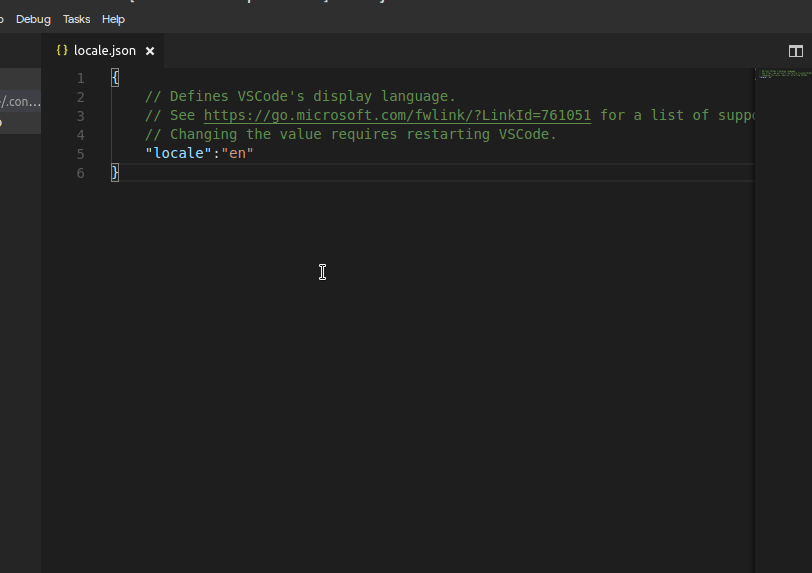

# VSCode Discord Extension


Have you ever been coding and your Discord friends have been memeing your chat?

Have you ever wanted to join in, but if you did, you would forget the **crucial** command that you have been working on forever?

There's a solution for that.

## Features

* Send messages
    * from Selections
    * or from user input

* Send files
    * from your current working directory
    * from a path made by you
    * from your current file


## Examples

* Sending a message


* Sending a file



## Upcoming Features

* URL image uploading
* Getting messages and formatting them neatly

## Extension Settings

To get your user token:

1. Login to Discord
2. Open your console (Ctrl+Shift+I or Command+Option+I)
3. Click the "Application" tab
4. Expand Storage > Local Storage > https://discordapp.com
5. Find the row with the "token" key
6. Copy the token to the right

To let VSCode access the token:

1. Go to File > Preferences > Settings or press Ctrl + Comma
2. Put this in the User Settings, where token is your actual token

```
{
    "discord.token": <token>
}
```
3. Profit.
## Known Issues

Calling out known issues can help limit users opening duplicate issues against your extension.

## Release Notes

### 0.0.1

Initial release of Discord


**Enjoy!**